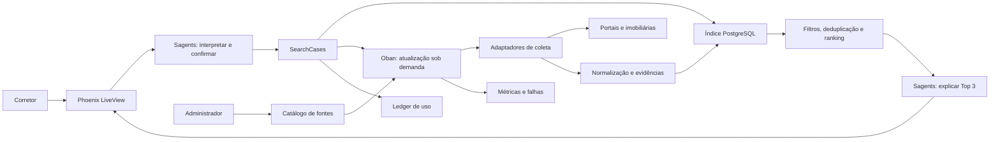

# SDD inicial — Arquitetura do HouseSearch

**Data:** 15 de julho de 2026

**Status:** proposta para revisão antes do plano de implementação

**Estilo:** monólito modular Phoenix com processamento assíncrono

## 1. Objetivo

Construir um MVP para corretores autônomos de Americana/SP que transforme um
pedido de compra residencial em uma shortlist explicada de três imóveis úteis
em até dez minutos.

O sistema combina dados persistidos com atualizações sob demanda. A IA atua na
interpretação e na explicação; coleta, validação, deduplicação, ranking e
cobrança permanecem determinísticos e auditáveis.

## 2. Decisões já tomadas

| Tema | Decisão |
|---|---|
| Usuário inicial | Corretor autônomo |
| Região | Americana/SP e cidades próximas configuradas pelo administrador |
| Operação | Compra de imóveis residenciais |
| Estratégia de dados | Índice local com atualização assíncrona sob demanda |
| Fontes | Portais e imobiliárias cadastrados somente pelo administrador |
| IA | Sagents para conversa, critérios e explicação; nunca como scraper ou motor de cobrança |
| Processamento | Oban com filas separadas e jobs idempotentes |
| Ranking | Filtros e pontuação determinísticos antes da explicação da LLM |
| Cobrança | Uma unidade por atendimento confirmado, válido por sete dias |
| Meta do piloto | Três opções úteis em até dez minutos |

## 3. Princípios

1. **Evidência antes de narrativa:** toda característica exibida deve apontar
   para o anúncio e para a coleta que a originou.
2. **Falha parcial é aceitável:** uma fonte indisponível não interrompe o
   atendimento quando outras fontes produzem resultados.
3. **IA nas bordas:** a LLM interpreta linguagem e explica decisões; regras de
   negócio críticas permanecem em Elixir.
4. **Fontes são configuração:** domínios, regiões, limites e estratégias não
   ficam espalhados em módulos ou prompts.
5. **Custo é parte da observabilidade:** cada coleta e chamada de LLM é
   atribuída a uma fonte e, quando aplicável, a um atendimento.
6. **Sem republicação:** o MVP mostra um resumo necessário à comparação e leva
   o corretor ao anúncio original.

## 4. Visão da arquitetura



### Fluxo híbrido

1. O Sagents devolve critérios estruturados e pede confirmação humana.
2. `SearchCases` cria o atendimento e um evento de uso na mesma transação.
3. O índice local produz candidatos imediatamente.
4. Fontes com última coleta superior a seis horas recebem jobs de atualização.
5. Cada adaptador coleta, normaliza e persiste anúncios de forma idempotente.
6. Novos dados fazem o atendimento ser recomputado e atualizam o LiveView.
7. Quando existem pelo menos três candidatos elegíveis, o Sagents recebe apenas
   os dados comprovados do Top 3 e produz as justificativas.
8. A busca permanece aberta por até dez minutos; depois disso o sistema entrega
   o melhor resultado parcial e identifica fontes que falharam.

## 5. Limites dos módulos

O MVP permanece em um único deploy Phoenix, mas os contextos não acessam tabelas
uns dos outros diretamente.

| Contexto | Responsabilidade | Dependências permitidas |
|---|---|---|
| `Accounts` | Corretor, administrador, autenticação e conta | Ecto |
| `Sources` | Cadastro, aprovação, região, política e saúde das fontes | Ecto |
| `Ingestion` | Adaptadores, coleta, normalização e evidências | `Sources`, Req, Floki |
| `Listings` | Anúncios normalizados, snapshots e deduplicação | Ecto |
| `SearchCases` | Critérios, ciclo de sete dias e estado do atendimento | `Listings`, `Usage` |
| `Ranking` | Elegibilidade, score e explicações factuais intermediárias | Dados imutáveis de entrada |
| `AI` | Sagents, prompts versionados e schemas de entrada/saída | `SearchCases`, `Ranking` |
| `Usage` | Franquia, eventos idempotentes e custo atribuído | Ecto |
| `Web` | LiveViews do corretor e do administrador | APIs públicas dos contextos |

`Oban.Worker` coordena chamadas às APIs públicas desses contextos; nenhum worker
concentra scraping, persistência, ranking e broadcast no mesmo módulo.

## 6. Modelo de dados

### Identidade e assinatura

| Schema | Campos essenciais |
|---|---|
| `accounts` | `name`, `status`, `timezone` |
| `users` | `email`, `hashed_password`, `role`, `status` |
| `memberships` | `account_id`, `user_id`, `role` |
| `subscriptions` | `account_id`, `plan_code`, `included_cases`, `period_start`, `period_end`, `status` |
| `usage_events` | `account_id`, `search_case_id`, `kind`, `units`, `cost_cents`, `idempotency_key` único |

No piloto haverá uma conta por corretor. A estrutura de conta evita uma
migração destrutiva quando imobiliárias com vários usuários forem atendidas.

### Fontes e coleta

| Schema | Campos essenciais |
|---|---|
| `sources` | `name`, `kind`, `base_url`, `adapter`, `status`, `refresh_interval_minutes`, `rate_limit_per_minute`, `terms_status`, `robots_status`, `credential_ref` |
| `source_regions` | `source_id`, `city`, `state`, `enabled` |
| `collection_runs` | `source_id`, `trigger`, `status`, `started_at`, `finished_at`, `items_seen`, `items_changed`, `error_code`, `cost_cents` |
| `listings` | `source_id`, `external_id`, `canonical_url`, `transaction`, `property_type`, `price_cents`, `city`, `neighborhood`, `address_text`, `bedrooms`, `bathrooms`, `parking_spaces`, `area_sqm`, `description`, `published_at`, `last_seen_at`, `status`, `data_hash` |
| `listing_snapshots` | `listing_id`, `collection_run_id`, `raw_payload`, `field_evidence`, `captured_at` |
| `property_clusters` | `dedup_key`, `status` |
| `property_cluster_members` | `property_cluster_id`, `listing_id`, `confidence` |

`adapter` é uma chave conhecida pelo código, não um nome de módulo fornecido pelo
usuário. `credential_ref` aponta para segredo de runtime; credenciais nunca são
gravadas no mapa de configuração da fonte.

### Atendimento e recomendação

| Schema | Campos essenciais |
|---|---|
| `search_cases` | `account_id`, `created_by_id`, `status`, `confirmed_at`, `refinement_expires_at`, `deadline_at` |
| `search_criteria_versions` | `search_case_id`, `version`, `criteria`, `confirmed_by_id`, `inserted_at` |
| `search_matches` | `search_case_id`, `criteria_version`, `property_cluster_id`, `score`, `score_breakdown`, `eligibility`, `computed_at` |
| `recommendations` | `search_case_id`, `criteria_version`, `rank`, `property_cluster_id`, `explanation`, `evidence`, `model`, `prompt_version` |
| `recommendation_feedback` | `recommendation_id`, `user_id`, `verdict`, `reason` |

Critérios e evidências usam JSONB versionado porque preferências variam, mas
campos usados para filtrar, relacionar ou cobrar permanecem colunas tipadas.

## 7. Contrato dos adaptadores

Cada estratégia de coleta implementa um comportamento equivalente a:

```elixir
@callback fetch(Source.t(), Region.t(), cursor :: map() | nil) ::
  {:ok, %{items: [RawListing.t()], next_cursor: map() | nil}}
  | {:error, Failure.t()}
```

O adaptador somente obtém dados e devolve uma estrutura bruta. A camada de
normalização valida URLs, converte moeda e medidas, registra evidências e gera o
`data_hash`. O persistidor aplica `upsert` por `source_id` e `external_id`; na
ausência de identificador externo, usa a URL canônica.

Fontes podem usar API oficial, feed, HTML estático ou navegador automatizado,
nessa ordem de preferência. Uma estratégia baseada em LLM para extrair HTML não
faz parte do MVP: ela dificulta auditoria e aumenta custo antes de a coleta
determinística ser validada.

## 8. Jobs Oban

| Worker | Fila | Função |
|---|---|---|
| `ScheduledSourceRefreshWorker` | `ingest_scheduled: 2` | Atualizar uma fonte/região conforme intervalo |
| `OnDemandSourceRefreshWorker` | `ingest_demand: 4` | Atualizar fonte desatualizada para um atendimento |
| `NormalizeBatchWorker` | `ingest_normalize: 4` | Validar, normalizar e persistir um lote |
| `RecomputeSearchCaseWorker` | `recommendations: 4` | Recalcular matches após mudança de dados |
| `ExpireListingsWorker` | `maintenance: 1` | Marcar anúncios não vistos após três coletas bem-sucedidas |

Jobs de fonte são únicos por `source_id`, região e janela de seis horas. Como a
unicidade do Oban impede inserções duplicadas, mas não limita a execução
concorrente, as filas também possuem limites explícitos. Consulte a
[documentação de unique jobs do Oban](https://oban.hexdocs.pm/unique_jobs.html).

Cada job registra `collection_run_id`, utiliza timeouts explícitos, classifica
erros como transitórios ou permanentes e pode ser executado novamente sem
duplicar anúncios ou eventos de cobrança.

## 9. Ranking e deduplicação

### Elegibilidade obrigatória

Um candidato precisa estar ativo, representar venda residencial, pertencer à
região configurada, ter link HTTP(S) válido e possuir preço e localização. Preço
máximo, tipo e cidade confirmados são filtros rígidos. Um campo opcional ausente
é tratado como desconhecido, nunca como correspondência positiva.

### Deduplicação

Primeiro são unidos anúncios com mesmo identificador dentro da fonte. Depois,
um `dedup_key` normalizado combina endereço, preço, área e dormitórios. Pares
incertos permanecem separados e recebem baixa confiança; a LLM não decide se
dois anúncios são o mesmo imóvel.

### Score de 0 a 100

- proximidade da faixa de preço: 30 pontos;
- localização e bairros preferidos: 25 pontos;
- dormitórios, vagas, área e demais preferências: 25 pontos;
- frescor, completude e confiança da fonte: 20 pontos.

O resultado persiste o detalhamento por critério. Empates são resolvidos por
frescor, completude e identificador estável, nessa ordem. Pesos serão alterados
somente com versão explícita e testes de regressão sobre casos reais anonimizados.

## 10. Uso do Sagents

O MVP usa **um agente conversacional**, não uma rede de agentes. A versão de
referência é Sagents 0.9.0, publicada no Hex em junho de 2026:
[pacote oficial](https://hex.pm/packages/sagents).

O agente pode chamar apenas ferramentas com schemas restritos:

- `propose_criteria`: apresenta critérios estruturados para confirmação;
- `confirm_criteria`: grava uma nova versão confirmada;
- `open_search_case`: cria o atendimento uma única vez;
- `refine_search_case`: cria nova versão durante a janela de sete dias;
- `explain_shortlist`: recebe três matches já ordenados e devolve explicações
  associadas a evidências existentes.

O agente não recebe ferramenta genérica de HTTP, SQL, execução de código ou
criação arbitrária de jobs. A saída estruturada é validada antes de persistir.
Se a explicação falhar, a UI continua mostrando o ranking e a decomposição
determinística.

## 11. LiveView e atualização em tempo real

O LiveView mostra estados explícitos: `draft`, `awaiting_confirmation`,
`searching`, `partial`, `complete` e `failed`. Resultados persistidos são a fonte
de verdade; PubSub apenas informa que o cliente deve recarregar o estado, sem
transportar o único exemplar de um resultado.

A tela pode exibir o índice local imediatamente e inserir atualizações conforme
os jobs terminam. Operações assíncronas devem traduzir sucesso e erro em estado
visível, comportamento suportado pelas APIs assíncronas do
[Phoenix LiveView](https://phoenix-live-view.hexdocs.pm/Phoenix.LiveView.html).

## 12. Erros e degradação

- Falha em uma fonte: registrar, exibir a fonte como indisponível e continuar.
- Timeout de dez minutos: finalizar como `partial` e entregar os melhores dados.
- Fonte com cinco falhas consecutivas: mudar para `degraded` e impedir jobs sob
  demanda até uma coleta administrativa bem-sucedida.
- Anúncio removido: marcar como indisponível e recomputar atendimentos abertos.
- LLM indisponível: mostrar score e razões determinísticas sem texto gerado.
- Evento PubSub perdido: recuperar o estado persistido ao reconectar.
- Cobrança duplicada: restrição única em `usage_events.idempotency_key` e criação
  transacional com `search_cases`.

## 13. Segurança, privacidade e conformidade

- Somente administradores cadastram e ativam fontes.
- `base_url` precisa usar HTTPS e host aprovado; redirects para hosts não
  aprovados são rejeitados para reduzir SSRF.
- Credenciais ficam em secrets de runtime e logs removem tokens e dados pessoais.
- Antes de ativar uma fonte, o administrador registra revisão de termos,
  `robots.txt`, método permitido, limite e data da revisão.
- Quando houver API ou feed oficial, scraping de HTML não é usado.
- O sistema armazena critérios do imóvel, não nome, telefone ou documentos do
  comprador; o corretor identifica seus clientes fora do MVP.
- Dados pessoais obedecem finalidade e necessidade conforme a
  [LGPD, Lei 13.709/2018](https://www.planalto.gov.br/ccivil_03/_ato2015-2018/2018/lei/l13709compilado.htm).
- Ativação comercial exige revisão jurídica dos termos de cada fonte; este SDD
  não presume autorização de coleta por uma página ser pública.

## 14. Observabilidade

Eventos Telemetry e logs estruturados devem incluir `account_id`,
`search_case_id`, `source_id`, `collection_run_id` e `job_id` quando aplicável.
Painéis mínimos:

- duração e sucesso de coleta por fonte;
- frescor e quantidade de anúncios ativos;
- tempo até primeiro resultado e até Top 3;
- atendimentos completos, parciais e sem resultado;
- custo de LLM e coleta por atendimento;
- taxa de utilidade por posição, fonte e versão do ranking.

Prompts, modelos e versões de ranking são persistidos com a recomendação para
permitir auditoria e comparação.

## 15. Estratégia de testes

1. Testes de contrato para todo adaptador usando fixtures gravadas e sanitizadas.
2. Testes unitários de normalização, URLs, moeda, deduplicação e score.
3. Testes de propriedade garantindo score entre 0 e 100 e idempotência de
   `upsert` e cobrança.
4. Testes de integração para transações Ecto, workers Oban e recuperação após
   falha parcial.
5. Testes do agente com modelo falso, validando schemas, confirmação humana e
   proibição de atributos sem evidência.
6. Teste LiveView do fluxo completo: pedido, confirmação, resultados locais,
   atualização assíncrona, Top 3 e refinamento.
7. Smoke tests externos separados da suíte padrão; testes locais e CI nunca
   dependem de portais reais.

## 16. Fases de entrega

1. **Fundação:** contas, autenticação, catálogo administrativo e ledger de uso.
2. **Dados:** contrato de adaptador, uma imobiliária parceira, persistência e
   observabilidade da coleta.
3. **Busca:** atendimento, critérios, índice local, ranking e feedback sem LLM.
4. **Híbrido:** Oban agendado e sob demanda, atualizações LiveView e tolerância a
   falhas.
5. **IA:** Sagents para conversa, confirmação e explicação baseada em evidências.
6. **Piloto:** três ou mais fontes aprovadas, cinco corretores e cinquenta casos.

Cada fase deve produzir software utilizável e testado. O projeto antigo em
`/Users/gustavooliveira/Documents/repositories/imobiliaria` serve apenas como
fonte de aprendizados; código e decisões não serão copiados automaticamente.

## 17. Critérios de aceitação do MVP

- Um administrador consegue cadastrar, revisar, ativar e desativar uma fonte.
- Coletas repetidas não duplicam anúncios.
- Um corretor confirma critérios e consome exatamente uma unidade.
- Refinamentos por sete dias não geram nova cobrança.
- A busca retorna dados locais e atualiza fontes desatualizadas em segundo plano.
- Falha de uma fonte não impede resultado parcial.
- Todo imóvel recomendado contém link, fonte e última verificação.
- A shortlist apresenta score verificável e explicação sem atributos inventados.
- Pelo menos 70% dos cinquenta casos do piloto entregam três opções úteis em até
  dez minutos.

## 18. Itens posteriores ao MVP

Aluguel, comprador final, equipes de imobiliárias, cadastro de fontes por
clientes, checkout automático, aplicativo móvel, navegador automatizado e
extração de HTML por LLM somente serão avaliados depois dos critérios do piloto.
