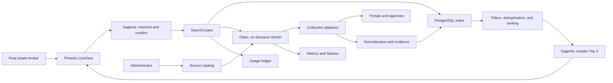

# Initial SDD — HouseSearch Architecture

**Date:** July 15, 2026

**Status:** proposal for review before the implementation plan

**Style:** Phoenix modular monolith with asynchronous processing

## 1. Objective

Build an MVP for independent real estate brokers in Americana, São Paulo, that
turns a residential purchase request into an explained shortlist of three useful
properties within ten minutes.

The system combines persisted data with on-demand refreshes. AI interprets and
explains; collection, validation, deduplication, ranking, and billing remain
deterministic and auditable.

## 2. Established decisions

| Topic | Decision |
|---|---|
| Initial user | Independent real estate broker |
| Region | Americana, São Paulo, and nearby cities configured by an administrator |
| Transaction | Residential property purchases |
| Data strategy | Local index with asynchronous on-demand refreshes |
| Sources | Portals and real estate agencies registered only by an administrator |
| AI | Sagents for conversation, criteria, and explanations; never as a scraper or billing engine |
| Processing | Oban with separate queues and idempotent jobs |
| Ranking | Deterministic filters and scoring before LLM explanations |
| Billing | One unit per confirmed search case, valid for seven days |
| Pilot target | Three useful options within ten minutes |

## 3. Principles

1. **Evidence before narrative:** every displayed property attribute must point
   to the listing and collection run that produced it.
2. **Partial failure is acceptable:** one unavailable source does not interrupt
   a search case when other sources produce results.
3. **AI at the edges:** the LLM interprets language and explains decisions;
   critical business rules remain in Elixir.
4. **Sources are configuration:** domains, regions, limits, and strategies are
   not scattered across modules or prompts.
5. **Cost is observable:** each collection operation and LLM call is attributed
   to a source and, when applicable, a search case.
6. **No republishing:** the MVP displays only the summary required for comparison
   and directs the broker to the original listing.

## 4. Architecture overview



### Hybrid flow

1. Sagents returns structured criteria and requests human confirmation.
2. `SearchCases` creates the search case and a usage event in one transaction.
3. The local index produces candidates immediately.
4. Sources whose latest collection is older than six hours receive refresh jobs.
5. Each adapter collects, normalizes, and persists listings idempotently.
6. New data triggers recomputation of the search case and updates the LiveView.
7. Once at least three eligible candidates exist, Sagents receives only the
   verified data for the Top 3 and produces the explanations.
8. The search remains open for up to ten minutes; after that, the system returns
   the best partial result and identifies failed sources.

## 5. Module boundaries

The MVP remains a single Phoenix deployment, but contexts do not access each
other's tables directly.

| Context | Responsibility | Permitted dependencies |
|---|---|---|
| `Accounts` | Broker, administrator, authentication, and account | Ecto |
| `Sources` | Source registration, approval, region, policy, and health | Ecto |
| `Ingestion` | Adapters, collection, normalization, and evidence | `Sources`, Req, Floki |
| `Listings` | Normalized listings, snapshots, and deduplication | Ecto |
| `SearchCases` | Criteria, seven-day lifecycle, and search case state | `Listings`, `Usage` |
| `Ranking` | Eligibility, score, and intermediate factual explanations | Immutable input data |
| `AI` | Sagents, versioned prompts, and input/output schemas | `SearchCases`, `Ranking` |
| `Usage` | Allowance, idempotent events, and attributed cost | Ecto |
| `Web` | Broker and administrator LiveViews | Public context APIs |

`Oban.Worker` coordinates calls to the public APIs of these contexts; no worker
combines scraping, persistence, ranking, and broadcasting in one module.

## 6. Data model

### Identity and subscriptions

| Schema | Essential fields |
|---|---|
| `accounts` | `name`, `status`, `timezone` |
| `users` | `email`, `hashed_password`, `role`, `status` |
| `memberships` | `account_id`, `user_id`, `role` |
| `subscriptions` | `account_id`, `plan_code`, `included_cases`, `period_start`, `period_end`, `status` |
| `usage_events` | `account_id`, `search_case_id`, `kind`, `units`, `cost_cents`, unique `idempotency_key` |

The pilot uses one account per broker. The account structure avoids a destructive
migration when the product later supports real estate agencies with multiple
users.

### Sources and collection

| Schema | Essential fields |
|---|---|
| `sources` | `name`, `kind`, `base_url`, `adapter`, `status`, `refresh_interval_minutes`, `rate_limit_per_minute`, `terms_status`, `robots_status`, `credential_ref` |
| `source_regions` | `source_id`, `city`, `state`, `enabled` |
| `collection_runs` | `source_id`, `trigger`, `status`, `started_at`, `finished_at`, `items_seen`, `items_changed`, `error_code`, `cost_cents` |
| `listings` | `source_id`, `external_id`, `canonical_url`, `transaction`, `property_type`, `price_cents`, `city`, `neighborhood`, `address_text`, `bedrooms`, `bathrooms`, `parking_spaces`, `area_sqm`, `description`, `published_at`, `last_seen_at`, `status`, `data_hash` |
| `listing_snapshots` | `listing_id`, `collection_run_id`, `raw_payload`, `field_evidence`, `captured_at` |
| `property_clusters` | `dedup_key`, `status` |
| `property_cluster_members` | `property_cluster_id`, `listing_id`, `confidence` |

`adapter` is a key recognized by the application, not a module name supplied by
a user. `credential_ref` points to a runtime secret; credentials are never
stored in the source configuration map.

### Search cases and recommendations

| Schema | Essential fields |
|---|---|
| `search_cases` | `account_id`, `created_by_id`, `status`, `confirmed_at`, `refinement_expires_at`, `deadline_at` |
| `search_criteria_versions` | `search_case_id`, `version`, `criteria`, `confirmed_by_id`, `inserted_at` |
| `search_matches` | `search_case_id`, `criteria_version`, `property_cluster_id`, `score`, `score_breakdown`, `eligibility`, `computed_at` |
| `recommendations` | `search_case_id`, `criteria_version`, `rank`, `property_cluster_id`, `explanation`, `evidence`, `model`, `prompt_version` |
| `recommendation_feedback` | `recommendation_id`, `user_id`, `verdict`, `reason` |

Criteria and evidence use versioned JSONB because preferences vary, while fields
used for filtering, relationships, or billing remain typed columns.

## 7. Adapter contract

Each collection strategy implements a behavior equivalent to:

```elixir
@callback fetch(Source.t(), Region.t(), cursor :: map() | nil) ::
  {:ok, %{items: [RawListing.t()], next_cursor: map() | nil}}
  | {:error, Failure.t()}
```

The adapter only retrieves data and returns a raw structure. The normalization
layer validates URLs, converts currency and measurements, records evidence, and
generates `data_hash`. The persistence layer performs an `upsert` by `source_id`
and `external_id`; when an external identifier is unavailable, it uses the
canonical URL.

Sources may use an official API, feed, static HTML, or browser automation, in
that order of preference. LLM-based HTML extraction is outside the MVP because
it impairs auditing and increases cost before deterministic collection has been
validated.

## 8. Oban jobs

| Worker | Queue | Function |
|---|---|---|
| `ScheduledSourceRefreshWorker` | `ingest_scheduled: 2` | Refresh one source and region on its configured interval |
| `OnDemandSourceRefreshWorker` | `ingest_demand: 4` | Refresh a stale source for a search case |
| `NormalizeBatchWorker` | `ingest_normalize: 4` | Validate, normalize, and persist a batch |
| `RecomputeSearchCaseWorker` | `recommendations: 4` | Recompute matches after data changes |
| `ExpireListingsWorker` | `maintenance: 1` | Mark listings not seen after three successful collections |

Source jobs are unique by `source_id`, region, and six-hour window. Because Oban
uniqueness prevents duplicate insertion but does not limit concurrent execution,
queues also have explicit limits. See the
[Oban unique jobs documentation](https://oban.hexdocs.pm/unique_jobs.html).

Each job records `collection_run_id`, uses explicit timeouts, classifies errors
as transient or permanent, and can run again without duplicating listings or
billing events.

## 9. Ranking and deduplication

### Required eligibility

A candidate must be active, represent a residential sale, belong to the
configured region, have a valid HTTP(S) link, and include both price and
location. Confirmed maximum price, property type, and city are hard filters. A
missing optional field is treated as unknown, never as a positive match.

### Deduplication

Listings with the same identifier within one source are merged first. A
normalized `dedup_key` then combines address, price, area, and bedroom count.
Uncertain pairs remain separate and receive low confidence; the LLM does not
decide whether two listings represent the same property.

### Score from 0 to 100

- proximity to the price range: 30 points;
- location and preferred neighborhoods: 25 points;
- bedrooms, parking, area, and other preferences: 25 points;
- freshness, completeness, and source confidence: 20 points.

The result persists a criterion-level breakdown. Ties are resolved by freshness,
completeness, and stable identifier, in that order. Weights change only through
an explicit version and regression tests against anonymized real search cases.

## 10. Sagents usage

The MVP uses **one conversational agent**, not a network of agents. The reference
version is Sagents 0.9.0, published on Hex in June 2026:
[official package](https://hex.pm/packages/sagents).

The agent may call only tools with constrained schemas:

- `propose_criteria`: present structured criteria for confirmation;
- `confirm_criteria`: store a newly confirmed criteria version;
- `open_search_case`: create the search case exactly once;
- `refine_search_case`: create a new version during the seven-day window;
- `explain_shortlist`: receive three already-ranked matches and return
  explanations tied to existing evidence.

The agent has no generic HTTP, SQL, code execution, or arbitrary job creation
tool. Structured output is validated before persistence. If explanation
generation fails, the UI continues to display the deterministic ranking and its
score breakdown.

## 11. LiveView and real-time updates

The LiveView displays explicit states: `draft`, `awaiting_confirmation`,
`searching`, `partial`, `complete`, and `failed`. Persisted results are the source
of truth; PubSub only tells the client to reload state and never carries the sole
copy of a result.

The screen may show local index results immediately and insert updates as jobs
complete. Asynchronous operations must translate success and failure into a
visible state, behavior supported by the asynchronous APIs in
[Phoenix LiveView](https://phoenix-live-view.hexdocs.pm/Phoenix.LiveView.html).

## 12. Errors and degradation

- Source failure: record it, display the source as unavailable, and continue.
- Ten-minute timeout: finish as `partial` and return the best available data.
- Five consecutive source failures: change the source to `degraded` and block
  on-demand jobs until an administrative collection succeeds.
- Removed listing: mark it unavailable and recompute open search cases.
- LLM unavailable: display the score and deterministic reasons without generated
  text.
- Missed PubSub event: recover persisted state on reconnect.
- Duplicate billing: enforce a unique constraint on
  `usage_events.idempotency_key` and create it transactionally with
  `search_cases`.

## 13. Security, privacy, and compliance

- Only administrators register and activate sources.
- `base_url` must use HTTPS and an approved host; redirects to unapproved hosts
  are rejected to reduce SSRF risk.
- Credentials remain in runtime secrets, and logs remove tokens and personal
  data.
- Before activating a source, an administrator records the terms review,
  `robots.txt` review, permitted method, limit, and review date.
- When an official API or feed exists, HTML scraping is not used.
- The system stores property criteria, not the buyer's name, phone number, or
  documents; the broker identifies clients outside the MVP.
- Personal data follows purpose limitation and data minimization principles
  under Brazil's [General Data Protection Law (LGPD), Law 13,709/2018](https://www.planalto.gov.br/ccivil_03/_ato2015-2018/2018/lei/l13709compilado.htm).
- Commercial activation requires legal review of each source's terms; this SDD
  does not assume that a public page authorizes collection.

## 14. Observability

Telemetry events and structured logs include `account_id`, `search_case_id`,
`source_id`, `collection_run_id`, and `job_id` when applicable. Minimum
dashboards:

- collection duration and success by source;
- freshness and active listing count;
- time to first result and time to Top 3;
- complete, partial, and empty search cases;
- LLM and collection cost per search case;
- usefulness rate by position, source, and ranking version.

Prompt, model, and ranking versions are persisted with each recommendation to
support auditing and comparison.

## 15. Testing strategy

1. Contract tests for every adapter using recorded and sanitized fixtures.
2. Unit tests for normalization, URLs, currency, deduplication, and scoring.
3. Property-based tests guaranteeing scores remain between 0 and 100 and that
   listing `upsert` and billing remain idempotent.
4. Integration tests for Ecto transactions, Oban workers, and recovery after
   partial failure.
5. Agent tests with a fake model, validating schemas, human confirmation, and
   the prohibition against unsupported attributes.
6. A full LiveView test covering the request, confirmation, local results,
   asynchronous updates, Top 3, and refinement.
7. External smoke tests separated from the default suite; local and CI tests
   never depend on live portals.

## 16. Delivery phases

1. **Foundation:** accounts, authentication, administrative source catalog, and
   usage ledger.
2. **Data:** adapter contract, one partner agency, persistence, and collection
   observability.
3. **Search:** search case, criteria, local index, ranking, and feedback without
   an LLM.
4. **Hybrid:** scheduled and on-demand Oban jobs, LiveView updates, and fault
   tolerance.
5. **AI:** Sagents for conversation, confirmation, and evidence-based
   explanations.
6. **Pilot:** three or more approved sources, five brokers, and fifty search
   cases.

Each phase must produce usable and tested software. The previous project at
`/Users/gustavooliveira/Documents/repositories/imobiliaria` is a source of
lessons only; code and decisions will not be copied automatically.

## 17. MVP acceptance criteria

- An administrator can register, review, activate, and deactivate a source.
- Repeated collections do not duplicate listings.
- A broker confirms criteria and consumes exactly one unit.
- Refinements made within seven days do not generate another charge.
- A search returns local data and refreshes stale sources in the background.
- Failure of one source does not prevent a partial result.
- Every recommended property includes a link, source, and latest verification.
- The shortlist provides a verifiable score and explanations without invented
  attributes.
- At least 70% of the fifty pilot search cases deliver three useful options
  within ten minutes.

## 18. Post-MVP items

Rentals, end buyers, real estate agency teams, customer-managed sources,
automated checkout, a native mobile application, browser automation, and
LLM-based HTML extraction will be considered only after the pilot criteria are
met.
